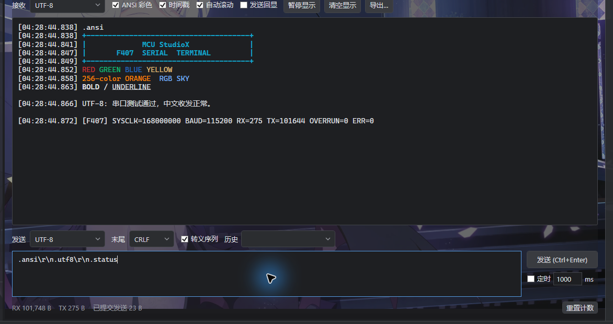
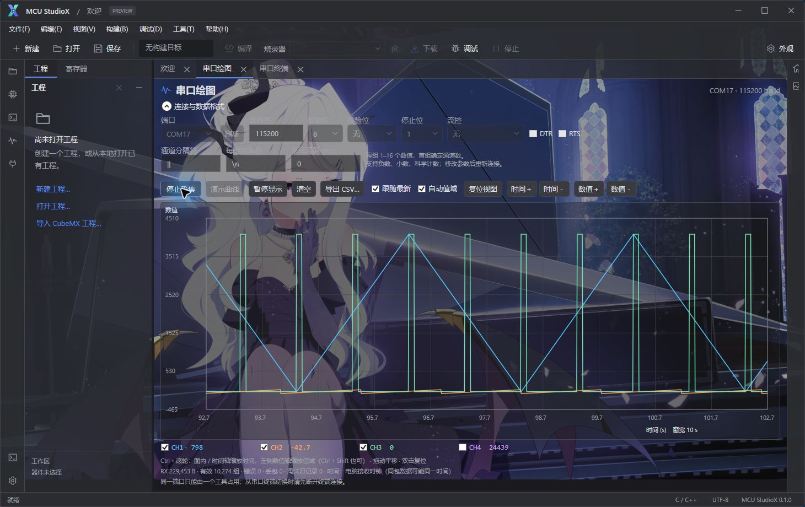

# MCU StudioX

MCU StudioX 是 Windows x64 单片机 IDE。当前源码版本为 **0.2.4 预览版**，使用 C#、.NET 10 和 WPF 构建。

IDE 提供 C/C++ 编辑与代码提示、CMake 工程构建、器件包导入、固件下载与调试界面、串口工具、Git 图谱，以及带 MCP 工具的 AI 助手。器件能力取决于具体 `.mcupack`、工具链和硬件；尚未通过实板验证的型号不应视为已完成下载或调试适配。经过许可审查的部分器件包见 [MCU-StudioX-MCUPacks](https://github.com/XieJunHui9566/MCU-StudioX-MCUPacks)。

## 0.2.4 更新

新增反汇编和 FreeRTOS 调试窗口，并向内置 Agent 与外部 MCP 提供 `debug_disassemble`、`debug_rtos_snapshot`。修复了 WCH 固件校验误判和无效内存被识别为 RTOS 数据的问题；器件包管理可清理被新版完整覆盖的重复版本，WCH 包配方补入已核实的 FreeRTOS 模板。2026-09-26 已在 STM32F407ZG / ST-Link 和 CH32V307VCT6 / WCH-LinkE 上完成对应固件的 RTOS 实板 MCP 验收。详见 [0.2.4 发行说明](docs/RELEASE-0.2.4.md)、[源码调试](docs/DEBUGGING.md)与 [FreeRTOS 使用和验证范围](docs/RTOS_DEBUGGING.md)。

## AI 助手与 MCP

0.2.3 源码接入工程对话、历史对话、运行中追加提示、模型思考强度与上下文/缓存用量显示。Agent 通过同一套 MCP 工具读取和修改当前工程、编译、操作 Git、调试、烧录、收发串口与绘图；外部客户端也可连接 `StudioX.Cli mcp`。读取外部示例目录须经会话授权，写入、硬件连接和下载等操作仍需逐次确认。Skill 提供构建修复、器件资料、调试串口与 MCU 代码风格指导。`pdf_list`、`pdf_inspect`、`pdf_page` 可读取工程或已授权目录中的数据手册与原理图，并将页面局部图像交给支持视觉输入的模型。详见 [AI/MCP 说明](docs/AI_AGENT.md)与[外部客户端说明](docs/AI_MCP_EXTERNAL.md)。

## 在线器件包同步

源码支持手动检查公开器件包仓库并按需同步下载。「器件与模板」页及「文件」菜单均有入口；检查更新只比对版本，不下载器件包。用户确认同步后才下载、校验并导入新版本。离线时本地包仍可使用。0.2.4 在新版同身份包完整覆盖旧版型号和模板、且内容核验通过时清理冗余旧版；未被完整覆盖的旧版继续保留，已有工程的器件副本不随此清理升级。公开仓库目前只有经过再分发检查的部分包。实现与校验边界见[在线器件包说明](docs/REMOTE_PACKS.md)和[0.2.4 发行说明](docs/RELEASE-0.2.4.md)。下方网盘分享的 0.2.2 安装包早于这些源码改动。

## 安装包

0.2.4 的 Windows x64 安装包另行制作。本次 GitHub 发布范围为源码，暂不提供新的安装包下载链接。

项目维护者分享的 Windows x64 **0.2.2 安装包压缩文件**：[百度网盘下载 0.2.2.zip](https://pan.baidu.com/s/1f_TDn-r8pw0ZpTL9uipnIg?pwd=h9ff)，提取码：`h9ff`。网盘压缩包未在本仓库托管，其内容和散列值尚未由本仓库核验。安装与第三方材料状态见[安装与分发说明](docs/INSTALLER.md)，此次图标修复见[0.2.2 发行说明](docs/RELEASE-0.2.2.md)。

## 实际运行界面

前三张截图取自 Windows 上运行的 MCU StudioX 0.2.2；后两张是 2026-09-22 早期开发预览版的 STM32F407 实板串口验收。STC 工程在 IDE 内重新编译成功；Git 图谱使用演示仓库。截图展示对应版本的界面与操作，不代表其他器件均已通过实板下载或调试验收。

**STC IAP15F2K61S2：编辑 LCD1602/UART 测试程序并通过 SDCC 编译。** 左侧显示编译后的 RAM 和 Flash 占用，底部状态栏显示退出代码 0。


**STC 工程设置：** 器件信息、优化级别、程序 Flash 容量上限，以及串口下载与时钟配置入口。


**Git 图谱：** 演示仓库中的主线、功能分支、提交记录与文件差异。


**STM32F407 实板串口验收（2026-09-22）：** 通过 CH340 连接的测试固件回传 168 MHz 时钟、115200 波特率及收发/错误计数。此图记录当时的硬件验收，并非 0.2.4 的全部功能复测。



**STM32F407 实板串口绘图验收（2026-09-22）：** IDE 从 CH340 COM17 接收实板产生的四通道信号并实时绘图；截图中 CH4 曲线已隐藏，因此可见三条曲线。这是固件测试信号，不是 ADC 测量结果。



## 从源码构建

需要 Windows 10/11 x64 和 `global.json` 指定的 .NET 10 SDK。进入本仓库目录后运行：

```powershell
.\tools\Build.ps1 -Configuration Release
```

也可以在 Visual Studio 或 Rider 打开 `StudioX.slnx`。调试运行桌面程序时，先按对应准备脚本配置本机运行资源；发行构建还需要已准备的编译器、OpenOCD、GDB、CMake、Ninja、Git、clangd 和器件包。此源码仓库不包含这些大型运行资源，也不包含用户账号凭据。

## 目录

| 路径 | 内容 |
| --- | --- |
| `src/` | IDE、应用服务、构建引擎、器件包、设备与扩展模块 |
| `tools/` | 构建、运行资源准备、器件包生成和离线校验脚本 |
| `examples/` | 示例工程、模板及器件包生成配方 |
| `docs/` | 架构、格式、工程与 GitHub 协作说明 |
| `licenses/`、`runtime/` | 第三方许可与来源声明 |

器件包使用 StudioX 格式 1；其清单、文件索引及工程结构见[格式说明](docs/FORMATS.md)和[工程布局](docs/PROJECT_LAYOUT.md)。程序结构见[架构说明](docs/ARCHITECTURE.md)，多人协作见[GitHub 协作说明](docs/GITHUB_COLLABORATION.md)。

## 发布范围与许可

本仓库只提供经过筛选的 IDE 源码快照。构建缓存、本机工程、硬件诊断记录、用户数据和凭据均不属于源码发布内容。厂商 Logo 未纳入本快照，选择器使用文字缩写显示。器件包及其厂商 SDK 单独管理；各器件包仍需遵守对应厂商的授权和再分发条件。上方安装包链接由项目维护者通过外部网盘分享，本仓库不托管安装包。

本项目自有源码采用 [MIT 许可证](LICENSE)，版权归 2026 XieJunHui9566 所有。厂商名称和 Logo、第三方库、工具链、SDK 及其他外部素材不因收录在仓库或安装包中而改用 MIT；详情见 [第三方声明](NOTICE.md)、`licenses/` 和 `runtime/THIRD-PARTY-NOTICES.txt`。
