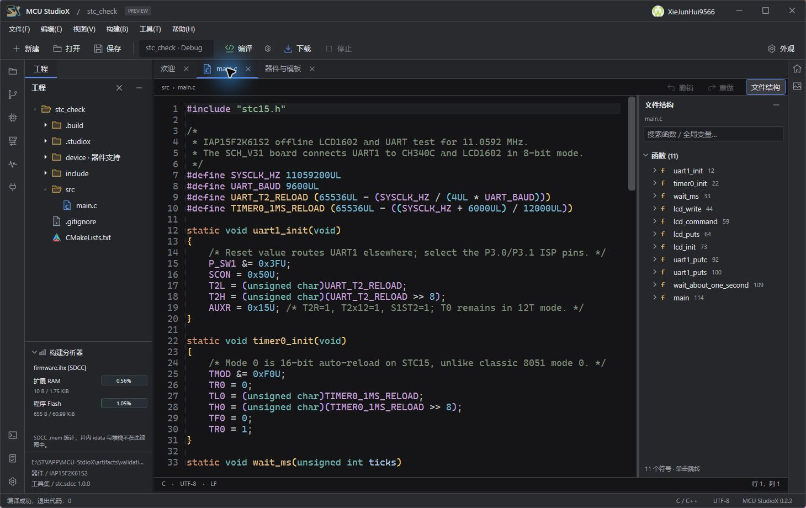
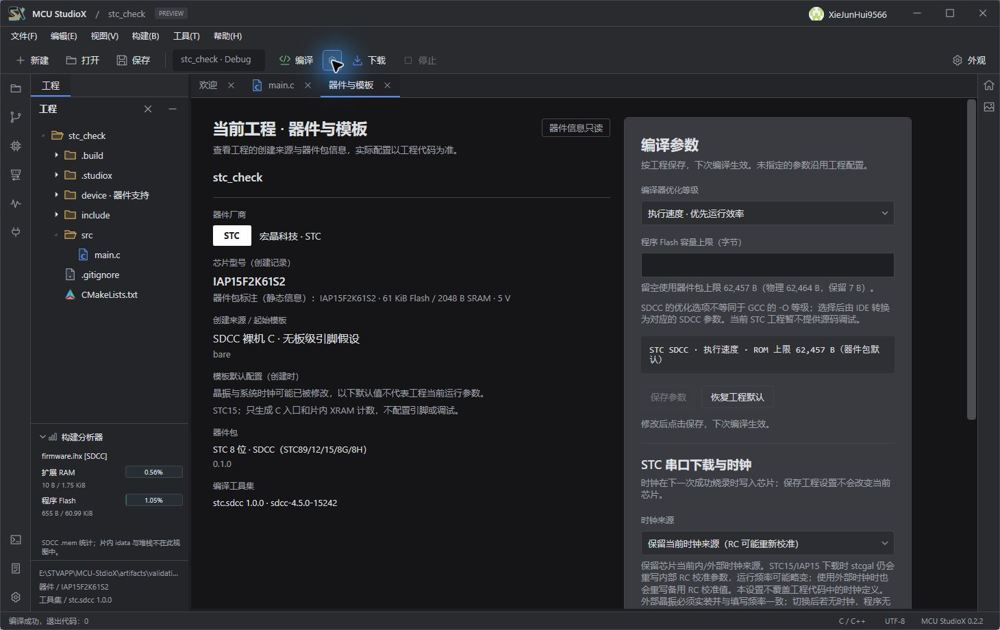
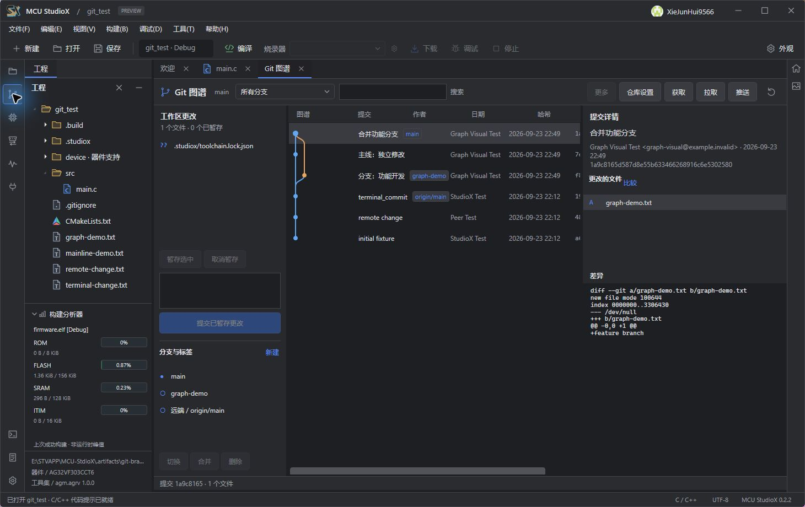

# MCU StudioX

MCU StudioX 是 Windows x64 单片机 IDE。当前源码版本为 **0.2.3 预览版**，使用 C#、.NET 10 和 WPF 构建。

IDE 提供 C/C++ 编辑与代码提示、CMake 工程构建、器件包导入、固件下载与调试界面、串口工具，以及 Git 图谱和 GitHub 协作。器件能力取决于具体 `.mcupack`、工具链和硬件；尚未通过实板验证的型号不应视为已完成下载或调试适配。经过许可审查的部分器件包见 [MCU-StudioX-MCUPacks](https://github.com/XieJunHui9566/MCU-StudioX-MCUPacks)。

## 在线器件包同步

0.2.3 源码新增启动后后台检查公开器件包仓库，下载、校验并自动导入缺少的最新版本。「文件 → 从 GitHub 同步器件包」也可手动重试；离线时本地包仍可使用。新建工程列表保留可选的旧版本，已有工程不会因同步改变。公开仓库目前只有经过再分发检查的部分包。实现与校验边界见[在线器件包说明](docs/REMOTE_PACKS.md)和[0.2.3 发行说明](docs/RELEASE-0.2.3.md)。下方网盘分享的 0.2.2 安装包早于此功能。

## 安装包

项目维护者分享的 Windows x64 **0.2.2 安装包压缩文件**：[百度网盘下载 0.2.2.zip](https://pan.baidu.com/s/1f_TDn-r8pw0ZpTL9uipnIg?pwd=h9ff)，提取码：`h9ff`。网盘压缩包未在本仓库托管，其内容和散列值尚未由本仓库核验。安装与第三方材料状态见[安装与分发说明](docs/INSTALLER.md)，此次图标修复见[0.2.2 发行说明](docs/RELEASE-0.2.2.md)。

## 实际运行界面

以下截图直接取自 Windows 上运行的 MCU StudioX 0.2.2。STC 工程在 IDE 内重新编译成功；Git 图谱使用演示仓库。截图展示界面操作，不代表其他器件均已通过实板下载或调试验收。

**STC IAP15F2K61S2：编辑 LCD1602/UART 测试程序并通过 SDCC 编译。** 左侧显示编译后的 RAM 和 Flash 占用，底部状态栏显示退出代码 0。



**STC 工程设置：** 器件信息、优化级别、程序 Flash 容量上限，以及串口下载与时钟配置入口。



**Git 图谱：** 演示仓库中的主线、功能分支、提交记录与文件差异。



## 从源码构建

需要 Windows 10/11 x64 和 `global.json` 指定的 .NET 10 SDK。进入本仓库目录后运行：

```powershell
.\tools\Build.ps1 -Configuration Release
```

也可以在 Visual Studio 或 Rider 打开 `StudioX.slnx`。调试运行桌面程序时，先按对应准备脚本配置本机运行资源；发行构建还需要已准备的编译器、OpenOCD、GDB、CMake、Ninja、Git、clangd 和器件包。此源码仓库不包含这些大型运行资源，也不包含用户账号凭据。

## 目录

| 路径 | 内容 |
| --- | --- |
| `src/` | IDE、应用服务、构建引擎、器件包、设备与扩展模块 |
| `tools/` | 构建、运行资源准备、器件包生成和离线校验脚本 |
| `examples/` | 示例工程、模板及器件包生成配方 |
| `docs/` | 架构、格式、工程与 GitHub 协作说明 |
| `licenses/`、`runtime/` | 第三方许可与来源声明 |

器件包使用 StudioX 格式 1；其清单、文件索引及工程结构见[格式说明](docs/FORMATS.md)和[工程布局](docs/PROJECT_LAYOUT.md)。程序结构见[架构说明](docs/ARCHITECTURE.md)，多人协作见[GitHub 协作说明](docs/GITHUB_COLLABORATION.md)。

## 发布范围与许可

本仓库只提供经过筛选的 IDE 源码快照。构建缓存、本机工程、硬件诊断记录、用户数据和凭据均不属于源码发布内容。厂商 Logo 未纳入本快照，选择器使用文字缩写显示。器件包及其厂商 SDK 单独管理；各器件包仍需遵守对应厂商的授权和再分发条件。上方安装包链接由项目维护者通过外部网盘分享，本仓库不托管安装包。

本项目自有源码采用 [MIT 许可证](LICENSE)，版权归 2026 XieJunHui9566 所有。厂商名称和 Logo、第三方库、工具链、SDK 及其他外部素材不因收录在仓库或安装包中而改用 MIT；详情见 [第三方声明](NOTICE.md)、`licenses/` 和 `runtime/THIRD-PARTY-NOTICES.txt`。
