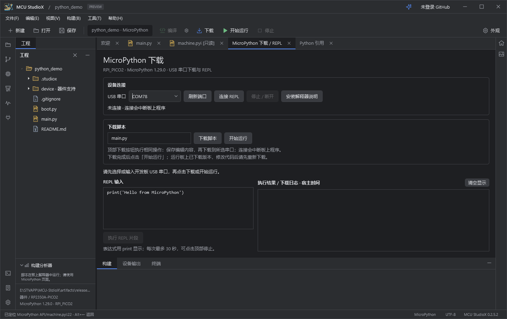
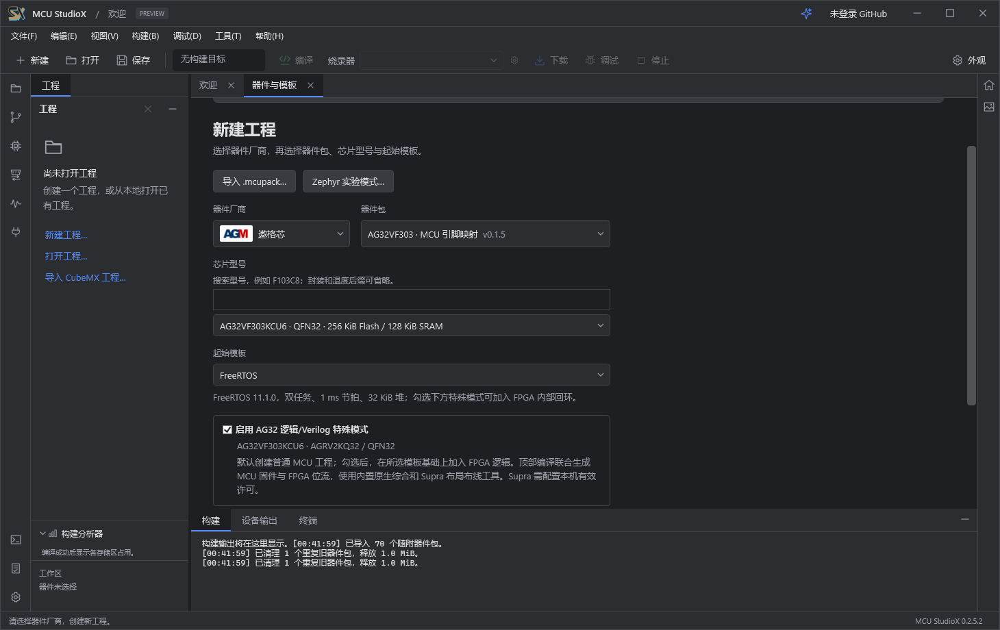

# MCU StudioX

面向多系列 MCU 的独立 Windows 重型 IDE，目标是**开箱即用、新手友好、功能完整、通过插件扩展，并保持系统运行环境独立**。当前源码版本 **0.2.6.10**，采用 **C# / .NET 10 / WPF**。AG32、STM32、CH32、RP 等系列共享通用工程与编辑能力。产品从 `0.1.0-foundation` 开始，与历史插件 `0.17` 分开版本管理。

使用方式是「安装 IDE → 选择器件包与开发环境组件 → 开发」。完整版预装编译器、OpenOCD、GDB、CMake、Ninja 等开发环境组件，轻量版按工程需要获取；两种版本都内置 Git 和语言服务。`.mcupack` 保存器件信息、启动/链接文件、厂商源码与工程模板。**当前是开发预览版，已接通编辑、构建下载、源码与反汇编调试、FreeRTOS 状态、串口终端、协议解析、串口绘图和 LVGL PC 窗口预览。**

## 0.2.6.10 · 完整版与轻量版

新增统一的开发环境组件管理，支持从 GitHub 已验证目录获取、手动导入 `.mcutoolchain`、并存版本、禁用、恢复、删除和调试环境检查。按工程锁定组件身份与内容，打开 IDE 不再全量校验全部组件；新建 ESP32 工程可以明确选择已安装的 IDF 版本。

两种安装包保留相同 IDE、71 个器件包、语言服务、Git 和插件宿主，完整版沿用原有预装组件，轻量版不携带开发环境组件。组件独立升级，不随 IDE 升级改写原工程的锁定版本。

[下载完整安装包、轻量安装包与源码](https://github.com/XieJunHui9566/MCU-StudioX/releases/tag/v0.2.6.10) · [发行说明与预装清单](docs/RELEASE-0.2.6.10.md) · [开发环境组件库](https://github.com/XieJunHui9566/MCU-StudioX-Toolchains)

## 0.2.5.4B · 2026-10-03 重打包

产品版本保持 **0.2.5.4B**。本次加入常用代码模板（保存选区、变量填写、缩写补全和一次撤销）、SVD 外设寄存器入口、ESP-IDF Core Dump 分析及工程锁定工具准备，内置帮助增加到 38 篇。完整安装包沿用已核对的工具集和 71 个器件包，可覆盖安装到原目录并保留用户设置。

[下载本次安装包与源码](https://github.com/XieJunHui9566/MCU-StudioX/releases/tag/v0.2.5.4B-rebuild-20261003) · [本次说明](docs/RELEASE-0.2.5.4B-REBUILD.md) · [代码模板使用](docs/CODE_TEMPLATES.md)

## 0.2.5.4B 更新

新增调试连接向导、HardFault/ESP 故障工作台、构建历史与体积对比、工具/插件/源码组件分发及回退；补充首个工程完整引导和只读调试插件工作流。大工程树、快开和 IDF 打开自检在后台执行，减少主界面等待。内置帮助增加到 37 篇。

[下载 0.2.5.4B 安装包与源码](https://github.com/XieJunHui9566/MCU-StudioX/releases/tag/v0.2.5.4B) · [更新说明](docs/RELEASE-0.2.5.4B.md) · [操作与验证范围](docs/PRODUCT_WORKFLOWS.md)

## 0.2.5.4A 更新

新增工程健康检查与故障修复入口、工具占用与升级管理，完善 32 篇内置帮助，修复 ESP-IDF ESP32-S3 的 Xtensa 路径冲突。程序员助手插件支持位运算与进制转换，作为独立插件提供；安装包延续不捆绑插件的发行方式，保留用户已经安装的插件。

[下载 0.2.5.4A 安装包与源码](https://github.com/XieJunHui9566/MCU-StudioX/releases/tag/v0.2.5.4A) · [更新说明](docs/RELEASE-0.2.5.4A.md)

## 0.2.5.3 更新

新增 OpenOCD 变量绘图、中英双语错误与警告；完善工程级搜索替换、C/C++ 语义编辑、重启草稿恢复及工作台工具。内置 Agent 新增编辑器修改预览、任务撤销，以及「全面授权」「完全访问」模式。

[下载 0.2.5.3 安装包](https://github.com/XieJunHui9566/MCU-StudioX/releases/tag/v0.2.5.3) · [更新说明与截图](docs/RELEASE-0.2.5.3.md)

## 2026-09-29 更新

工程搜索替换、C/C++ 实时诊断、语义引用与重命名及编辑现场恢复已随 0.2.5.3 提供；快捷键和验证方法见 [工程编辑工作区](docs/EDITOR_WORKSPACE.md)。以下保留 0.2.5.2 的发行说明和截图。

- **AG32 系统层与 FreeRTOS**：统一外设头文件、自动延时、命名引脚与 GPIO 电气配置；普通 MCU 模板通过特殊模式复选框进入 MCU + FPGA。
- **Python / MicroPython**：补全、定义跳转、引用查找、查找替换；RP2040 / RP2350 的 C SDK 与 MicroPython 模板；顶部下载、串口 REPL 和运行按钮。
- **构建与下载**：显示逻辑单元占用，简化 AG32 联合下载操作。

详细改动与验证范围见 [2026-09-29 发行说明](docs/RELEASE-0.2.5.2.md)。






## 0.2.5.1 更新

- **AG32 图形化引脚分配**：七款精确型号及对应封装；左键菜单分配、整条引脚着色、功能名称和冲突标红，支持时钟与约束生成。
- **MCU + FPGA 联合构建**：F7 编译 C 固件与自定义 Verilog，调用内置 VE / 原生综合 / Supra 生成逻辑镜像；下载前弹窗确认两段镜像。
- **Verilog 电路图**：使用内置 Yosys 生成实际连接图，支持层级查看与元件定位。
- **RTL 仿真与波形**：内置 Icarus Verilog，支持 testbench、信号筛选、缩放和拖动蓝色时间光标；静态时序报告与 RTL 波形分别展示，尚未接入 SDF 布局后延时仿真。
- **插件与 Agent**：开放 C# SDK 和 Python / Rust / C++ 进程协议，支持命令、面板与 Agent 工具；新增 AG32 配置与仿真的 MCP 接口。

完整介绍、使用条件与验证范围见 [0.2.5.1 发行说明](docs/RELEASE-0.2.5.1.md)。Supra 布局布线需要用户自己的有效许可证，安装包不包含私人许可。

### 新版实际界面

以下是 0.2.5.1 程序运行隔离示例的实际界面，未使用私人背景或账号数据。


## 0.2.5 更新

- 内置 ESP-IDF 5.5.4，支持 ESP32/WROOM、P4、S3、C3/C5/C6；ESP8266 使用独立 RTOS SDK 3.4。模板采用对应 SDK 的官方示例。
- 「器件与模板 → ESP 模组与存储」提供 125 个已核实预设及自定义配置，设置 Flash、PSRAM、适用的芯片版本与单双核。配置独立保存，构建核对 SDK 实际接受的参数；内置 Agent 和外部 MCP 可以读取所选规格。
- LVGL 8.3.x 可使用内置 PC C/C++ 工具链在 Windows 窗口预览自定义 UI；支持多层目录中的库发现、入口与资源审阅，分别展示目标构建占用和 PC 运行统计。
- 修复 AG32 `.ve` 文件实际高亮时崩溃的问题；拆分会话、协议、授权、文件同步与模拟设备职责，并统一源码及注释约定。

详细用法见 [Espressif 支持](docs/ESPRESSIF_SUPPORT.md)、[LVGL PC 预览](docs/LVGL-PC-PREVIEW.md)和[源码职责导航](docs/RESPONSIBILITIES.md)。

## 在线器件包

当前源码支持从公开的 [MCU StudioX MCUPacks 仓库](https://github.com/XieJunHui9566/MCU-StudioX-MCUPacks)手动检查器件包更新、同步下载新版本。器件包联网操作只在点击「器件与模板」页的对应按钮或「文件」菜单项后进行；检查更新只比较目录与本地版本，不下载。仅删除新版完整覆盖的旧包，旧版独有型号或模板继续保留；网络不可用时仍可使用本地器件包。目前公开仓库只提供通过再分发检查的部分器件包，不代表 IDE 支持的全部型号。此前分享的 0.2.2 安装包早于这些源码改动。下载与校验方式见[在线器件包说明](docs/REMOTE_PACKS.md)。

## AI Agent 与命令行

打开工程后点击右上角 AI 按钮展开右侧聊天栏，从「工具 → AI 接口设置…」配置 API。默认使用 DeepSeek API（Base URL `https://api.deepseek.com`、模型 `deepseek-flash`），也可配置兼容服务的 URL 和模型；API Key 保存在当前用户凭据中。内置 Agent 通过 MCP 调用工程源码、编译、OpenOCD/STC 烧录、Git、调试、串口、绘图和器件资料工具；变更或连接设备前逐次请求确认。外部客户端可连接便携版中的 stdio MCP 主机。功能边界见 [AI Agent 与命令行说明](docs/AI_AGENT.md)，配置见 [外部 MCP 客户端接入](docs/AI_MCP_EXTERNAL.md)。

## 开发入口

新建工程会自动创建独立 Git 仓库（`main` 分支）并生成构建产物忽略规则。左侧 Git 图标或“工具 → Git 图谱”提供提交图、差异、暂存/提交和分支操作；“工具 → GitHub 协作”提供浏览器登录、克隆、远端同步与 Pull Request 创建、审阅、合并。“工具 → 工程终端”（Ctrl+反引号）仍可执行 Git 命令。Git 随 IDE 内置，普通用户无需单独安装。首次开发构建需运行 `tools/Prepare-GitRuntime.ps1`。详见 [Git 与工程终端](docs/GIT-TERMINAL.md)及 [GitHub 协作](docs/GITHUB_COLLABORATION.md)。

已有 STM32CubeMX CMake 工程可从欢迎页或文件菜单「导入 CubeMX CMake 工程」接入：保留原有源码、库、时钟与构建配置，使用内置工具链编译，并提供实际编译参数驱动的代码提示和跳转。详见[导入说明与当前范围](docs/CUBEMX_IMPORT.md)。

开发机器需 .NET 10 SDK 和 Windows 桌面运行时（`global.json` 固定 SDK 10.0.400）。普通用户使用自包含安装包，无需单独安装 .NET。

```powershell
# 在源码仓库根目录运行
.\tools\Build.ps1
dotnet run --project src/StudioX.Desktop
```

也可以在 Visual Studio / Rider 打开 `StudioX.slnx`，启动 `StudioX.Desktop`。

首次在另一台开发机准备代码提示组件，运行 `tools/Prepare-LanguageServer.ps1` 下载固定版本 clangd；AG32 的标准 C 头文件由 `tools/Prepare-Ag32LanguageHeaders.ps1 -ToolchainDirectory <本地已准备的 AgRV 工具链目录>` 复制。本机已准备完成。构建/发布会自动将这些资源打包到 IDE，普通用户不用安装插件或设置 PATH。脚本不下载厂商 SDK、不安装或启动固件编译工具。

## 已搭建的模块

| 目录 | 当前职责 |
|---|---|
| src/StudioX.Foundation | 原子 JSON 存储、路径边界、外部进程与取消 |
| src/StudioX.Packages | 格式 1 清单、ZIP 打包/导入、文件索引与仓库 |
| src/StudioX.Engine | 精确工具目录、工程规划与生成、CMake 构建调用 |
| src/StudioX.Devices | 传输接口、连接所有权、广播订阅、模拟源、记录格式 |
| src/StudioX.Extensions.Abstractions | 命令、面板、Agent 工具及解码插件 SDK 与双向协议 DTO |
| src/StudioX.Extensions | 插件清单和独立宿主客户端 |
| src/StudioX.PluginHost | 插件子进程入口、程序集依赖解析 |
| src/StudioX.Application | 工作台组合服务、工程文件读写、clangd/LSP、主题和偏好 |
| src/StudioX.Desktop | 桌面壳、工程树、语法编辑器、模拟视图、日志 |
| src/StudioX.Cli | 包作者/开发者命令入口 |
| examples | C#、Python、Rust、C++ 插件示例、JSON 主题、工具清单结构 |
| tools | 构建和发布脚本 |

桌面壳已经接到应用服务，采用 CLion 风格的紧凑菜单、工具条、工程侧栏、文档标签和底部输出区。欢迎页包含最近工程和常用入口；`Ctrl+Alt+S` 打开外观设置，支持深浅主题、本地背景图片、静音循环视频、透明度/遮罩/模糊，以及代码字体、字号和柔光开关。工程树读取真实目录，文件按类型显示独立图标，双击打开；AvalonEdit 提供语法配色、行号、当前行提示、撤销与查找。内置 clangd 提供 C/C++ 代码补全、头文件名提示和函数参数提示。已接入 OpenOCD 下载、真实串口和 GDB 调试，具体器件范围以对应文档为准。工具实验室使用明确标识的模拟数据。API 2 插件可以贡献命令、声明式面板和 Agent 工具，并通过应用接口访问工程、编辑缓冲区、构建及已授权设备操作；自定义主题和面板不加载任意 XAML。

支持同时打开多个文件，点击标签或 `Ctrl+Tab` / `Ctrl+Shift+Tab` 切换；各文件保留未保存内容、撤销历史和编辑位置。标签 X、鼠标中键或 `Ctrl+W` 关闭，修改过的文件会询问保存；`Ctrl+Shift+S` 全部保存。普通退出保留草稿，重启自动恢复工程、标签顺序、选中源码、光标和未保存内容；撤销历史仅保留在本次运行。标签过多时横向滚动，同名文件显示目录。`--open <工程目录> --files src/main.c CMakeLists.txt` 显式打开指定工程时优先使用命令行目标。

工程树右键支持新建文件/文件夹、打开、复制/粘贴、重命名、复制完整/相对路径、在 Windows 资源管理器中显示和刷新。树内 `Ctrl+C` / `Ctrl+V` 复制粘贴，`F2` 重命名，`F5` 刷新；支持从 Windows 剪贴板复制文件及文件夹到工程，同名项目另存副本。重命名同步已打开标签及导航历史，保留未保存内容和撤销记录；引用它们的 CMake 与 `#include` 路径仍需手动更新。

代码提示随输入自动弹出，也可按 `Ctrl+Space`；上下键选择，`Tab` / `Enter` 插入，`Esc` 关闭。输入函数的 `(`、`,` 时提示参数，`Ctrl+Shift+Space` 手动显示。菜单「编辑」也提供这两个入口。

C/C++ 代码中右键符号可「转到定义」或「转到声明」，也可按 `F12` / `Ctrl+F12`。鼠标停留在变量、函数、宏或成员上，显示类型/签名、声明文件和行列位置；`Alt+←` 返回，`Alt+→` 前进。跨文件跳转复用已打开标签，保留未保存内容和撤销历史；内置标准库头文件以只读标签打开。语言服务在后台索引工程源码与 SDK，初次索引期间部分实现位置可能尚未就绪。

`CMakeLists.txt` 和 `.cmake` 文件内置离线提示：常用命令及中文说明、当前文档与根配置声明的目标和变量、`${}` 变量引用、可见性/属性/配置值、工程内路径。输入命令会补入括号并提示参数；参数以空格分隔时自动更新，`Ctrl+Shift+Space` 查看用法与示例。这是编辑辅助，不执行配置脚本，也不要求安装 CMake 插件。用 `--open <工程目录> --file CMakeLists.txt` 可直接打开构建配置。

`.py`、`.pyw` 和 `.pyi` 已接入通用 Python 3 离线编辑支持：双色主题高亮、关键字与常用内置函数补全、当前文件符号及函数参数提示、`Ctrl+/` 注释。无需安装解释器；Python 运行、环境管理、跨文件语义分析和调试尚未接入。使用方法与边界见 [Python 编辑准备](docs/PYTHON_EDITOR.md)。

工程按 [分层 CMake 布局](docs/PROJECT_LAYOUT.md) 生成：根目录配置用于添加用户代码；`device/` 集中厂商库、寄存器定义、启动和链接文件，由内部 `CMakeLists.txt` 管理。固定环境与产物规则放在 `device/platform.cmake`，这两个生成文件在 IDE 中只读。构建不会重写用户根配置。

## AG32 子系列器件包

当前开发资源 `artifacts/device-packs-development/AGM/` 包含四个独立包：AG32VF303（同包 ID 升至 `0.1.3`）、AG32VF407、AG32VH303、AG32VH407（后三包为 `0.1.1`）。依据厂商 2026-06-01 手册覆盖七款精确型号，容量、封装、VE 目标和来源见 [系列配方](examples/packs/agm.ag32-series/README.md)。新构建自动导入随附包；已有工程保留原包锁定和用户文件。

欢迎页「新建工程」→ 厂商「AGM」→ 对应子系列 → 精确型号 →「编辑器演示」或「最小裸机工程」→ 输入工程名并选择父目录。创建后进入 `src/main.c`，Ctrl+S 保存；`logic/pins.ve` 的映射目标按真实封装生成，AG32 工程可打开图形化引脚分配页。

重建使用 `tools/New-Ag32Packs.py`，参数见 [AG32 系列包说明](examples/packs/agm.ag32-series/README.md)。各包不带工具链，复用 IDE 内置的 `agm.agrv/1.0.0`。普通 **编译** 联动内置 AGM VE / Supra 构建基础 GPIO/外设映射，无需外部 Quartus；未压缩逻辑保留物理 Flash 末尾 100 KiB，256 KiB 与 1 MiB 型号使用各自的应用区边界。VH 的 8 MiB PSRAM 独立记录，需要对应 HyperBus 逻辑，不并入片内 SRAM。

AG32 烧录器可选择 **DAP-Link（CMSIS-DAP）** 或 **J-Link（V9 及以上）**，均通过内置 AGM OpenOCD 的 SWD 通路下载和调试，默认 1000 kHz。旧 `agm-blaster` 设置按 CMSIS-DAP 兼容读取。J-Link 已核对厂商流程和离线脚本，尚未完成本项目实板验收，Windows USB 驱动要求见 [探针说明](examples/packs/agm.ag32-series/README.md#下载与调试探针)。

已核实硬件身份的 AG32VF303CCT6 支持 **下载** 显示并校验 MCU 与映射两个镜像，其它六款先提供离线工程与映射能力，硬件入口待逐型号核实。旧工程可从左侧功能栏的 **AG32 引脚分配** 显式启用且保留原配置；本机 Supra 厂商许可需单独导入，不随发行或工程上传。自定义 Verilog 已接入内置工具的一键联合构建、RTL 仿真和静态时序报告，见 [AG32 引脚映射与逻辑](docs/AG32_LOGIC_MODE.md)。AG32VF303CCT6 与官方 AGM DAP-LINK 经 USB 扩展坞，已完成 IDE 实机附加、固件校验、断点、单步、变量/寄存器/内存读取及退出恢复，见 [实机调试验收](docs/AG32-IDE-DEBUG-ACCEPTANCE-20260923.md)。电脑 USB 直连仍有间歇性通信故障，见 [通信排查](docs/AG32-DEBUG-INVESTIGATION-20260923.md)。历史单型号资源保留为 [验收夹具](examples/packs/agm.ag32vf303-preview/README.md)。

## STM32F1 / F4 独立子系列包

当前 0.1.1 包放在 `artifacts/packs/STM32-0.1.1/`：**23 个独立包、244 个基础型号**。按 STM32F100/101/102/103/105/107 和 STM32F401/405/407/410/411/412/413/415/417/423/427/429/437/439/446/469/479 分包；不同子系列不混装。

每个型号提供 **HAL、SPL、HAL + FreeRTOS、SPL + FreeRTOS**，默认外部 8 MHz 晶振并配置该型号最高系统时钟。IDE 新建工程页支持搜索型号；例如 STM32F103C8T6 可搜索并选择 STM32F103C8。包不包含工具链，复用 IDE 内置 Arm GNU / OpenOCD / CMake / Ninja。

已通过 F1 60 组、F4 92 组代表性编译，以及拆包后的补充检查、代码提示/跳转和界面预览；F407 已完成后续实板调试验收，其他型号不据此视为实板通过。[包清单](artifacts/packs/STM32-0.1.1/README.md) · [来源、重建与验证记录](docs/STM32_SERIES.md) · [调试验收](docs/STM32-DEBUG-ACCEPTANCE-20260922.md)。

## 普冉 PY32 软件适配

`artifacts/packs/Puya-0.1.1/` 包含 F002A、F002B、F003、F005、F030、F040、F071、F072 的 **8 个独立子系列包、22 个 DFP 容量型号**；`artifacts/packs/Puya-Additional-0.1.0/` 补充 F031、F032、F033、F090、F092 的 **5 个容量型号**；`artifacts/packs/Puya-F403-0.1.0/` 提供 **11 个官网完整料号**，`artifacts/packs/Puya-F410-F420-0.1.0/` 再提供 **8 个官网完整料号**。F0/F403/F410 提供 CMSIS、HAL、LL 空白工程，F420 提供 CMSIS、HAL；F0 的 DFP 通配型号可用完整订货号搜索，选择时仍需核对封装和容量。

F0 已完成 81 次工程创建和 81 次真实编译；F403 完成 19 次工程创建和 12 次代表性编译；F410/F420 完成 11 次工程创建和 5 次代表性编译，内存、ELF 与复位向量检查均通过。固件库来源、排除的容量或料号、F403 官方容量修正和验证边界见 [PY32 适配说明](docs/PY32.md)。没有实板，本批包暂不开放下载和调试。

## 兆易创新 GD32 软件适配

`artifacts/packs/GD32-0.1.0-r5/` 按固件系列提供 C10x、E10x、E23x、E50x、F10x、F1x0、F20x、F30x、F3x0、F403、F4xx、L23x 和 VF103 的 **13 个独立包、398 个 DFP/官网型号**；`artifacts/packs/GD32-E51x-0.1.0/` 另提供 **20 个 E51x 基础型号**。每个型号提供原厂标准外设库最小工程，E51x 还提供 CMSIS 模板；VF103 使用 RISC-V 工具链。型号表、原厂 SDK/DFP 来源与精确验证范围见 [GD32 适配说明](docs/GD32.md)。没有样品，本批包暂不开放下载和调试。

## 宏晶 STC 8 位软件适配

`artifacts/packs/STC8-0.1.0/stc.stc8-0.1.0.mcupack` 是统一的 STC 8 位包，首批收录 24 个经官方资料核实容量的 STC89、STC12、STC15、STC8G、STC8H 型号，包含 **IAP15F2K61S2**。工程使用内置 SDCC 4.5.0 + CMake 4.4.0 + Ninja 1.10.2，输出 IHX/HEX、MAP 和 MEM；可选择优化档位和程序 Flash 容量上限。按型号开放内部 RC 调整、外部晶振模式，并通过随附的 `stcgal 1.10` 提供 IDE 串口 ISP 下载。下载前会确认固件覆盖并核对芯片准确型号与容量；STC 源码调试尚未接入。24 个型号的 29 次新配置离线实编通过。IAP15F2K61S2 曾经命令行 ISP 下载并在赛点开发板验证 LCD1602 与 UART；新的 IDE 下载入口及其他型号尚未实板验收。使用步骤和验证边界见 [STC8 适配说明](docs/STC8.md)。

## 下载入口

RP2350 已新增独立的 **Pico SDK C 工程包**：最小 C 工程、GPIO 闪灯、双核队列三个模板，不包含 MicroPython。板型为 Pico 2 / 立创兼容板（RP2350A、12 MHz 晶振、4 MiB Flash），使用内置 Arm GNU 工具链和 CMSIS-DAP 下载/调试。包位于 `artifacts/packs/RP2350-0.1.0-verified/raspberrypi.rp2350-0.1.0.mcupack`，详细范围和验证记录见 [RP2350 说明](docs/RP2350.md)。

STM32 工程顶部「烧录器」下拉栏可选择 **ST-Link / DAP-Link (CMSIS-DAP) / J-Link**，旁边齿轮设置速度与可选序列号，并按工程保存。器件包和 CubeMX 工程共用此入口；点击「下载」自动保存、编译、检查固件、写入、校验并复位。不同芯片与探针的实际验收范围见 [下载说明](docs/DOWNLOAD.md) 及对应验收记录。

测试阶段生成的单片机工程、旧预览版、重复 SDK 和过期器件包输出已于 2026-09-22 清理。硬件备份与历史验证资料的存放位置见 [开发产物清理记录](docs/DEVELOPMENT-CLEANUP-20260922.md)；正式源码、器件配方、当前工具链与回归验证程序保留。

## RP2040 C SDK 独立包

树莓派两系列另已提供 **0.2.0 包的 MicroPython 适配**：保留三种 C 模板，增加两种 MicroPython 模板、板级 API 补全、USB 串口 REPL 与带备份/校验的脚本上传。新建时选择 MicroPython 模板，通过顶部「下载」按钮保存并下载脚本；「下载设置」打开串口与 REPL 页面。板型、官方解释器准备和离线验证边界见 [MicroPython 说明](docs/MICROPYTHON.md)。下文保留原 0.1.0 C SDK 验证记录。

树莓派分类新增 `raspberrypi.rp2040/0.1.0`，采用 Pico SDK 2.2.0，明确面向官方 Pico / Pico H：双核 Cortex-M0+、12 MHz 晶振、默认 125 MHz、2 MiB 外部 Flash 和 264 KiB SRAM。提供最小 C 工程、GPIO 闪灯及双核队列三个模板，使用内置工具链生成 ELF/BIN/HEX/MAP，不包含 MicroPython。

三个模板已完成真实离线编译及 SDK 代码提示验证；RP2040 下载与调试尚未实板核验，入口保持禁用。包与现有 RP2350 独立交付，详细配置和验证范围见 [RP2040 C SDK](docs/RP2040.md)。

## 内置工具链与编译

### Espressif 原生 SDK 工程

支持 **ESP32-WROOM-32、ESP32-P4、ESP32-S3、ESP32-C3/C5/C6** 的 ESP-IDF **5.5.4** 工程，以及独立 **ESP8266 RTOS SDK v3.4** 工程。七个小型器件包包含控制台与 FreeRTOS 任务模板，SDK、Python、编译器和构建工具由 IDE 共享内置，工程不复制 SDK。

F7 使用原生 SDK 配置与编译，保留 `sdkconfig`、应用 ELF/MAP、引导程序、分区表和多映像下载布局；ESP 下载通过项目 COM 设置调用内置 esptool。代码提示读取 SDK 实际 `compile_commands.json`，首次配置或编译后获得 SDK 宏与头文件；Xtensa 使用通用 32 位 C/C++ 解析，目标 ABI 由真实 SDK 编译验证。ESP 源码调试与实板验收尚未完成。使用范围见 [Espressif 支持](docs/ESPRESSIF_SUPPORT.md)，共享组件与准备命令见 [SDK 资源](docs/ESPRESSIF_RUNTIME.md)。

CH32V307 已接入标准库工程、FreeRTOS 模板及 WCH-Link 调试，支持 VCT6 / RCT6 / WCU6 的精确目标配置。CH32V203 的 V20x 型号也新增 FreeRTOS 模板；CCT6 与 CH595 的未核实移植不提供 RTOS 选项。FreeRTOS 已通过代表型号的真实离线编译，尚未实板运行验证，见 [CH32V307 模板](docs/CH32V307.md)、[CH32V203 适配](docs/CH32V203.md)。VCT6 + WCH-LinkE 原有裸机源码调试证据见 [调试验收](docs/CH32V307-DEBUG-ACCEPTANCE-20260922.md)。调试会先核对板上固件，不自动下载；旧 0.1.0 包工程缺少探针配置。

CH595 已提供独立 `wch.ch595/0.1.0` 器件包，收录 D/F/X 三种封装；三种工程均完成真实编译及下载/调试配置的离线验证。应用程序区限定为 240 KiB。接线、USB Boot 开启两线调试接口和当前实板验收边界见 [CH595 说明](docs/CH595.md)。

CH592 已提供独立 `wch.ch592/0.1.1` 器件包，收录 D/F/X 三种封装并新增官方 FreeRTOS 模板；CH592F 的新模板通过真实离线编译。应用程序区为 448 KiB。当前这套 CH592F 实板暂时无法与 WCH-Link 握手，实板下载与调试未验收；接线与测量日志见 [CH592 说明](docs/CH592.md)和[调试状态](docs/CH592-DEBUG-STATUS-20260924.md)。

| 工具集（版本均为 1.0.0） | GCC / 编译器标识 | OpenOCD |
|---|---|---|
| `agm.agrv` | AgRV GCC 11.1.0 / `agrv-gcc-11.1.0` | AGM 专用版，包版本 1.0.0 |
| `arm.gnu` | Arm GNU 15.2.Rel1（GCC 15.2.1）/ `arm-gnu-15.2.rel1` | xPack 0.12.0-7 |
| `riscv.xpack` | xPack RISC-V GCC 15.2.0 / `xpack-riscv-gcc-15.2.0` | xPack 0.12.0-7 |
| `wch.riscv` | WCH GCC 12.2.0 v1.4 / `wch-gcc-12.2.0-v1.4` | WCH 0.11.0+dev，2026-08-25 |

每套工具包含匹配的 GDB、binutils、标准库、头文件和运行 DLL，以及 CMake 4.4.0、Ninja 1.10.2、OpenOCD 脚本与许可证。通用工具集不代表所有芯片已适配；器件包必须明确引用匹配的工具集和编译器。

打开工程后按 **F7**（或顶部锤子图标），自动保存已修改文件并执行 CMake/Ninja。输出区显示原始工具日志，成功后在工程 `.build/` 生成 `firmware.elf/bin/hex/map`、`compile_commands.json` 和 `studiox-build.log`，并显示固件大小。菜单「构建 → 停止构建」取消进程树。编译不会重写根目录的用户 CMake 配置。

菜单「工具 → 检查内置工具链」校验全量 SHA-256 索引并检查工具启动，不连接调试器。工具路径由 IDE 安装位置解析，构建不依赖用户 PATH；工程锁定清单指纹，IDE/工程移动时重建机器相关的 CMake 缓存。

工具资源由开发者使用 [Prepare-ToolRuntime.ps1](tools/Prepare-ToolRuntime.ps1) 从已准备的完整本地发行目录整理至 `artifacts/tool-runtime`，详见 [工具准备说明](docs/TOOLCHAINS.md)。普通用户使用完整发行目录，无需安装编译器或配置路径。

## 发行骨架

```powershell
# 发布自包含桌面、全部已准备的工具链、插件宿主和示例插件
.\tools\Publish.ps1

# 开发者也可指定另一份已准备好的完整工具资源
.\tools\Publish.ps1 -RuntimeAssetsDirectory '<RUNTIME_ASSETS_ROOT>'
```

默认读取 `artifacts/tool-runtime`，输出在新的 `artifacts/MCUStudioX-<timestamp>/` 目录；已有目录不覆盖。缺少任何必需工具集或 clangd 时拒绝发布。整个目录一起复制后运行 `MCU StudioX.exe`，不能只复制 exe。用户数据在 `%LOCALAPPDATA%\MCUStudioX`，不往程序安装目录写入用户工程和偏好。

## 设计资料与当前范围

- [架构与依赖方向](docs/ARCHITECTURE.md)
- [新格式契约](docs/FORMATS.md)
- [发行目录](runtime/README.md)
- [插件开发与接口](docs/PLUGINS.md)
- [C# 插件示例](examples/StudioX.SamplePlugin/README.md)
- [API 1 解码示例](examples/StudioX.SampleDecoder/README.md)
- [后续开发顺序](docs/ROADMAP.md)
- [工作台与背景设置](docs/WORKBENCH_UI.md)

已进行 IDE 基础编译、工具完整性/启动检查、隔离 AG32 工程编译和通用 Arm/RISC-V C/C++ 编译链接检查。AG32 最小固件经授权完成实板烧录、回读和心跳验证，见 [验证记录](docs/TOOLCHAIN_VERIFICATION.md)；其后又通过 [IDE 实机调试验收](docs/AG32-IDE-DEBUG-ACCEPTANCE-20260923.md)。其他未实测器件不能据此视为板级通过。工具二进制放在忽略提交的构建资源中，源码仓库保留准备配方和许可资料；公共发行前还需补齐对应第三方源码分发材料。
