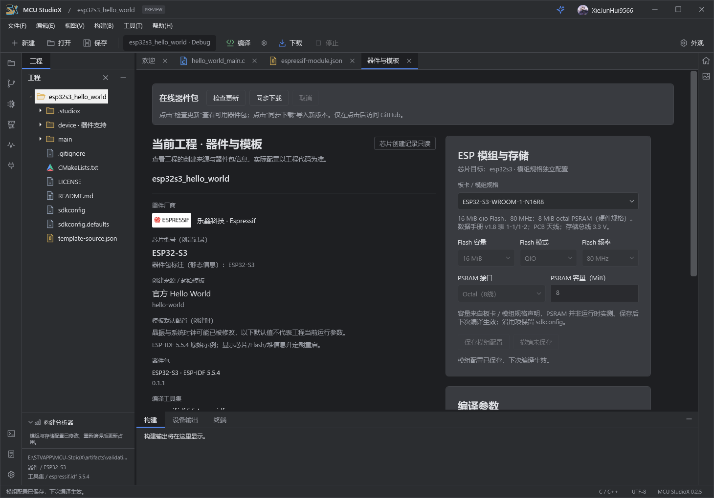
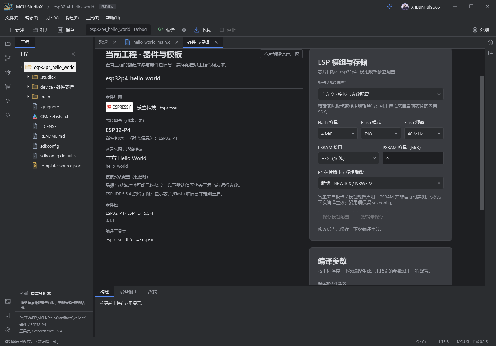
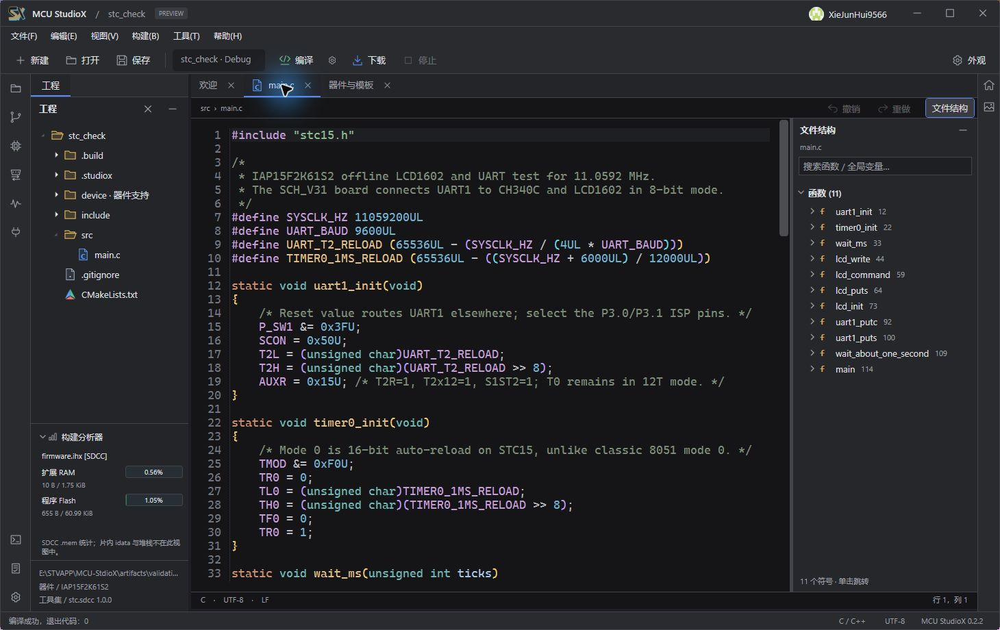
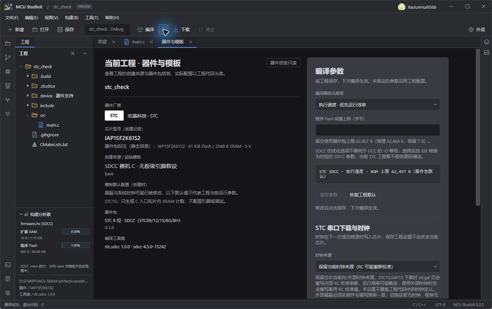
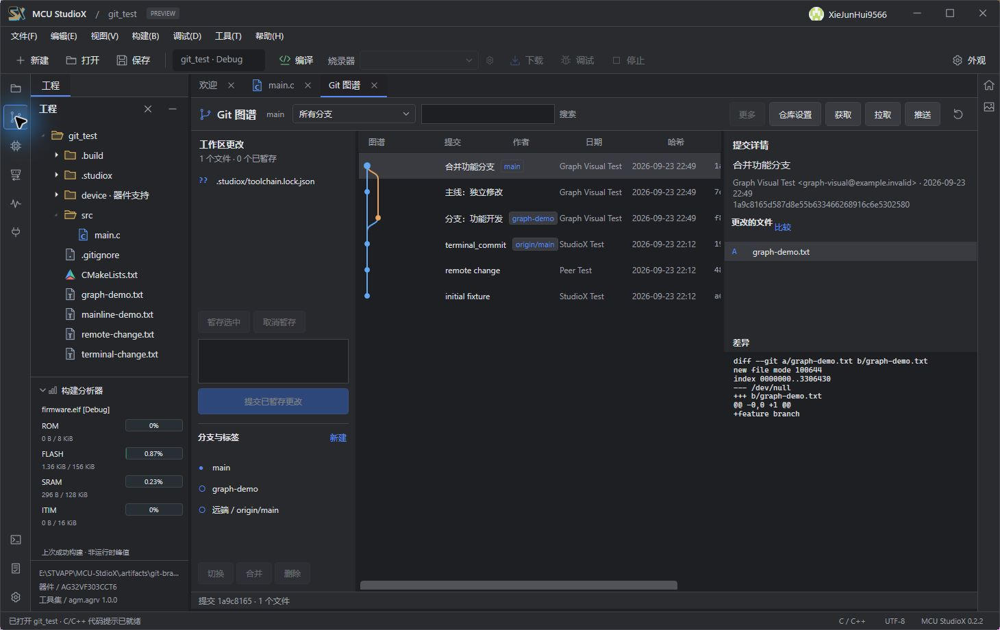
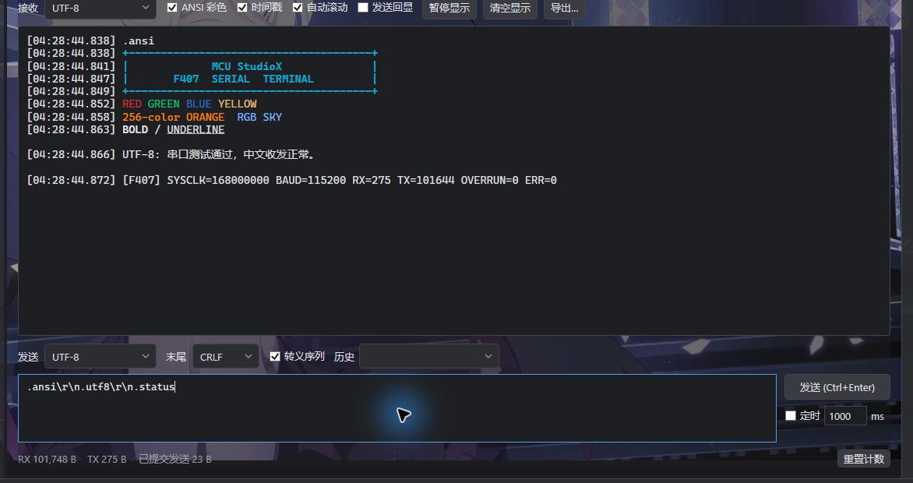
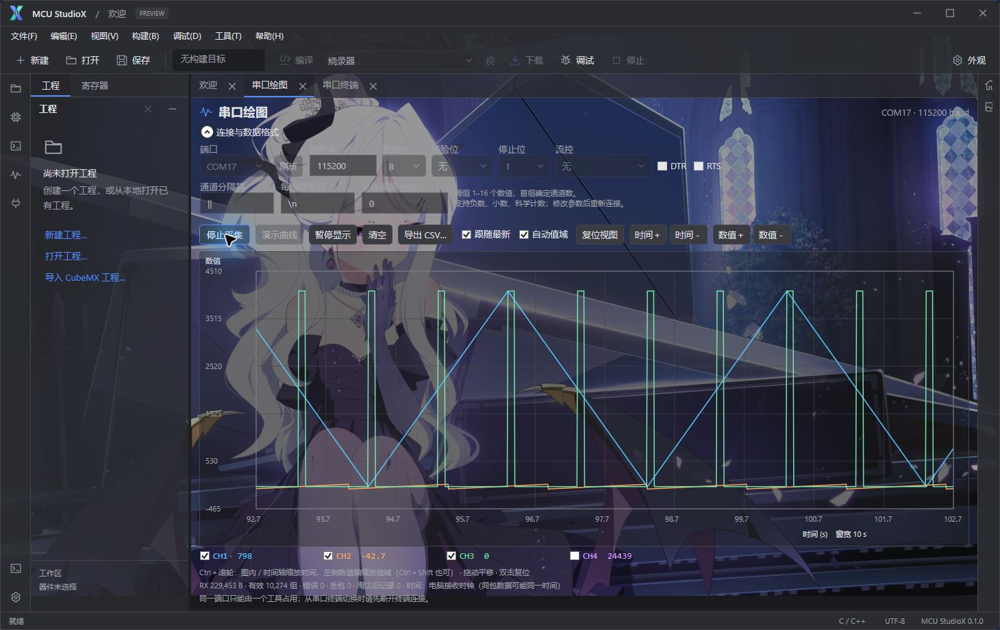

# MCU StudioX

MCU StudioX 是 Windows x64 单片机 IDE。当前源码版本为 **0.2.5 预览版**，使用 C#、.NET 10 和 WPF 构建。

IDE 提供 C/C++ 编辑与代码提示、CMake 工程构建、器件包导入、固件下载与调试界面、串口工具、Git 图谱，以及带 MCP 工具的 AI 助手。器件能力取决于具体 `.mcupack`、工具链和硬件；尚未通过实板验证的型号不应视为已完成下载或调试适配。经过许可审查的部分器件包见 [MCU-StudioX-MCUPacks](https://github.com/XieJunHui9566/MCU-StudioX-MCUPacks)。

## 0.2.5 更新

- 集成 ESP-IDF **5.5.4**，支持 ESP32/WROOM32、ESP32-P4、ESP32-S3、ESP32-C3/C5/C6；ESP8266 使用独立 RTOS SDK 3.4。七个芯片目标提供 **125 项模组与存储规格预设**，也可按板卡配置 Flash、PSRAM、P4 修订系列与经典 ESP32 核心模式。
- 内置 PC 编译链，在独立 Windows 窗口运行用户的 **LVGL 8.3.x UI**。配置向导支持多层库目录、UI 入口、字体、图片及运行时资源，并显示资源预算和 PC 运行统计。
- 修复 AG32 `.ve` 文件高亮导致 IDE 崩溃的问题；拆分 AI、工具协议、授权、进度和编辑器同步职责，统一代码排版与注释。

上述功能已进行软件配置、真实编译与离线界面验证，**不代表所有芯片或模组完成实板验收**。PC 的 FPS、堆和内存统计也不能代替 MCU 性能测量。此前反汇编、FreeRTOS、AI/MCP、串口与 Git 功能继续保留；既有 STM32F407ZG 和 CH32V307 实板范围见 [FreeRTOS 说明](docs/RTOS_DEBUGGING.md)。详情见 [0.2.5 发行说明](docs/RELEASE-0.2.5.md)、[Espressif 支持](docs/ESPRESSIF_SUPPORT.md)和 [LVGL PC 预览](docs/LVGL-PC-PREVIEW.md)。

## AI 助手与 MCP

0.2.3 源码接入工程对话、历史对话、运行中追加提示、模型思考强度与上下文/缓存用量显示。Agent 通过同一套 MCP 工具读取和修改当前工程、编译、操作 Git、调试、烧录、收发串口与绘图；外部客户端也可连接 `StudioX.Cli mcp`。读取外部示例目录须经会话授权，写入、硬件连接和下载等操作仍需逐次确认。Skill 提供构建修复、器件资料、调试串口与 MCU 代码风格指导。`pdf_list`、`pdf_inspect`、`pdf_page` 可读取工程或已授权目录中的数据手册与原理图，并将页面局部图像交给支持视觉输入的模型。详见 [AI/MCP 说明](docs/AI_AGENT.md)与[外部客户端说明](docs/AI_MCP_EXTERNAL.md)。

## 在线器件包同步

源码支持手动检查公开器件包仓库并按需同步下载。「器件与模板」页及「文件」菜单均有入口；检查更新只比对版本，不下载器件包。用户确认同步后才下载、校验并导入新版本。离线时本地包仍可使用。0.2.4 在新版同身份包完整覆盖旧版型号和模板、且内容核验通过时清理冗余旧版；未被完整覆盖的旧版继续保留，已有工程的器件副本不随此清理升级。公开仓库目前只有经过再分发检查的部分包。实现与校验边界见[在线器件包说明](docs/REMOTE_PACKS.md)和[0.2.4 发行说明](docs/RELEASE-0.2.4.md)。

## 安装包

Windows x64 **0.2.5 安装包与分卷**：[GitHub Release 下载](https://github.com/XieJunHui9566/MCU-StudioX/releases/tag/v0.2.5)。完整离线发行包含内置 SDK、工具链与器件包，安装目录约 **12 GB**。下载同组全部分卷至同一目录，用 7-Zip 打开 `.7z.001`，解压出完整 `Setup.exe` 或便携目录，再运行安装器或程序；具体文件和 SHA-256 以 Release 页面为准。

项目维护者此前分享的 **0.2.4 安装包**仍可通过[百度网盘下载 MCUStdioX](https://pan.baidu.com/s/5fh5exaJIgC6ThwSS_IdDOA)，该链接不代表 0.2.5。安装与第三方材料状态见[安装与分发说明](docs/INSTALLER.md)。安装包作为 Release 附件单独分发，不写入 Git 源码树。

## 0.2.5 软件界面

以下截图由 0.2.5 发行程序在隔离示例工程中生成，验证模组配置界面与保存行为，**不属于实板测试**。截图中的存储容量是配置规格，不是硬件探测结果。

**ESP32-S3-WROOM-1-N16R8：** 16 MiB Quad Flash 与 8 MiB Octal PSRAM 预设。



**ESP32-P4：** 自定义存储配置、HEX PSRAM 接口与芯片修订系列选项。



## 实际运行界面

前三张截图取自 Windows 上运行的 MCU StudioX 0.2.2；后两张是 2026-09-22 早期开发预览版的 STM32F407 实板串口验收。STC 工程在 IDE 内重新编译成功；Git 图谱使用演示仓库。截图展示对应版本的界面与操作，不代表其他器件均已通过实板下载或调试验收。

**STC IAP15F2K61S2：编辑 LCD1602/UART 测试程序并通过 SDCC 编译。** 左侧显示编译后的 RAM 和 Flash 占用，底部状态栏显示退出代码 0。



**STC 工程设置：** 器件信息、优化级别、程序 Flash 容量上限，以及串口下载与时钟配置入口。



**Git 图谱：** 演示仓库中的主线、功能分支、提交记录与文件差异。



**STM32F407 实板串口验收（2026-09-22）：** 通过 CH340 连接的测试固件回传 168 MHz 时钟、115200 波特率及收发/错误计数。此图记录当时的硬件验收，并非 0.2.5 的全部功能复测。



**STM32F407 实板串口绘图验收（2026-09-22）：** IDE 从 CH340 COM17 接收实板产生的四通道信号并实时绘图；截图中 CH4 曲线已隐藏，因此可见三条曲线。这是固件测试信号，不是 ADC 测量结果。



## 从源码构建

需要 Windows 10/11 x64 和 `global.json` 指定的 .NET 10 SDK。进入本仓库目录后运行：

```powershell
.\tools\Build.ps1 -Configuration Release
```

也可以在 Visual Studio 或 Rider 打开 `StudioX.slnx`。调试运行桌面程序时，先按对应准备脚本配置本机运行资源；发行构建还需要已准备的编译器、OpenOCD、GDB、CMake、Ninja、Git、clangd 和器件包。此源码仓库不包含这些大型运行资源，也不包含用户账号凭据。

## 目录

| 路径 | 内容 |
| --- | --- |
| `src/` | IDE、应用服务、构建引擎、器件包、设备与扩展模块 |
| `tools/` | 构建、运行资源准备、器件包生成和离线校验脚本 |
| `examples/` | 示例工程、模板及器件包生成配方 |
| `docs/` | 架构、格式、工程与 GitHub 协作说明 |
| `licenses/`、`runtime/` | 第三方许可与来源声明 |

器件包使用 StudioX 格式 1；其清单、文件索引及工程结构见[格式说明](docs/FORMATS.md)和[工程布局](docs/PROJECT_LAYOUT.md)。程序结构见[架构说明](docs/ARCHITECTURE.md)，多人协作见[GitHub 协作说明](docs/GITHUB_COLLABORATION.md)。

## 发布范围与许可

本仓库只提供经过筛选的 IDE 源码快照。构建缓存、本机工程、硬件诊断记录、用户数据和凭据均不属于源码发布内容。厂商 Logo 未纳入本快照，选择器使用文字缩写显示。器件包及其厂商 SDK 单独管理；各器件包仍需遵守对应厂商的授权和再分发条件。完整安装包通过 Release 附件分发，旧版网盘链接单独保留；大型二进制不进入 Git 源码树。

本项目自有源码采用 [MIT 许可证](LICENSE)，版权归 2026 XieJunHui9566 所有。厂商名称和 Logo、第三方库、工具链、SDK 及其他外部素材不因收录在仓库或安装包中而改用 MIT；详情见 [第三方声明](NOTICE.md)、`licenses/` 和 `runtime/THIRD-PARTY-NOTICES.txt`。
