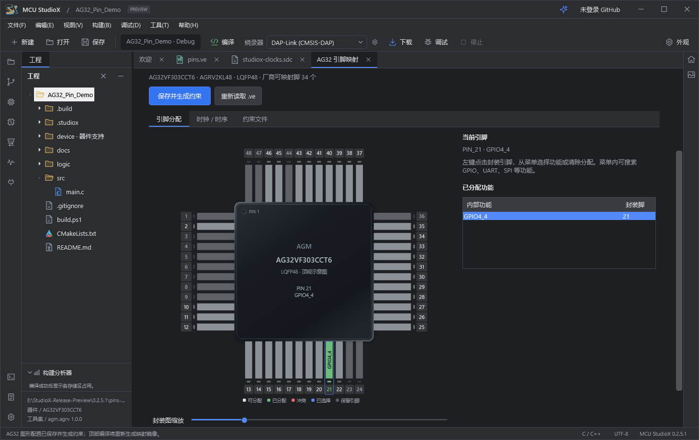
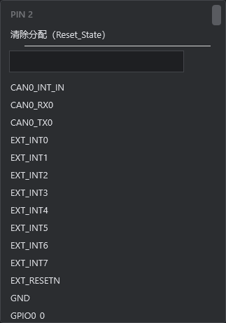
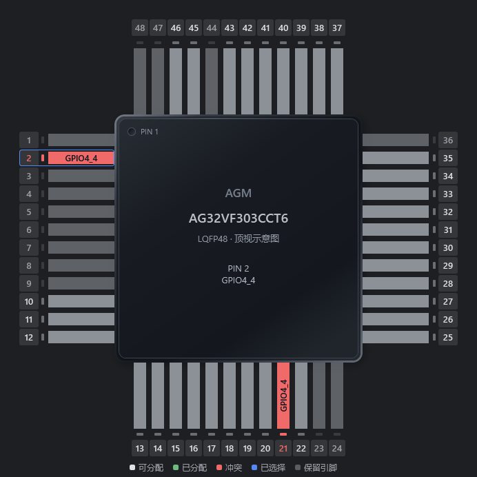
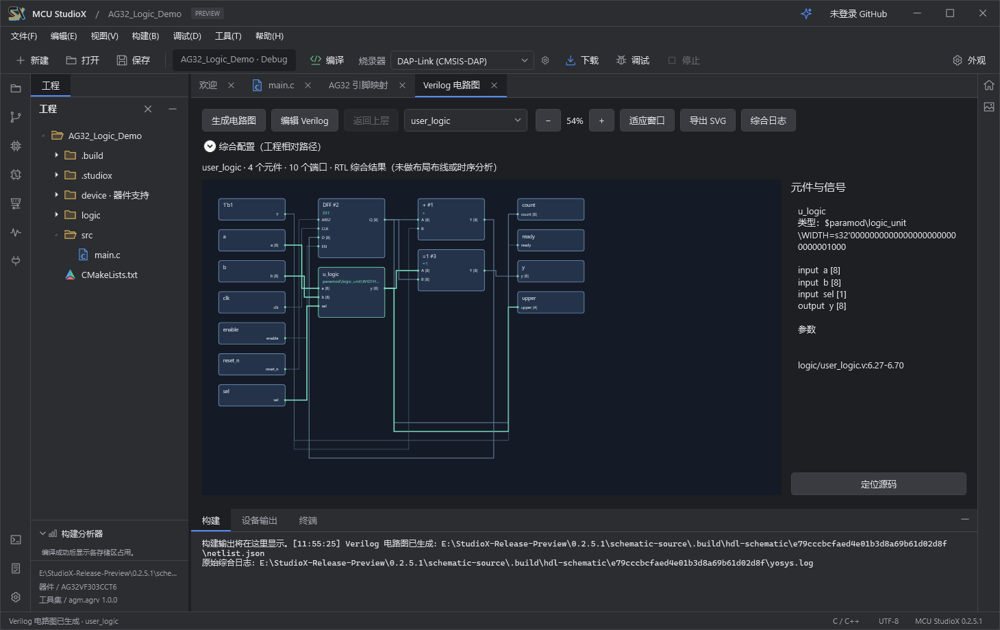
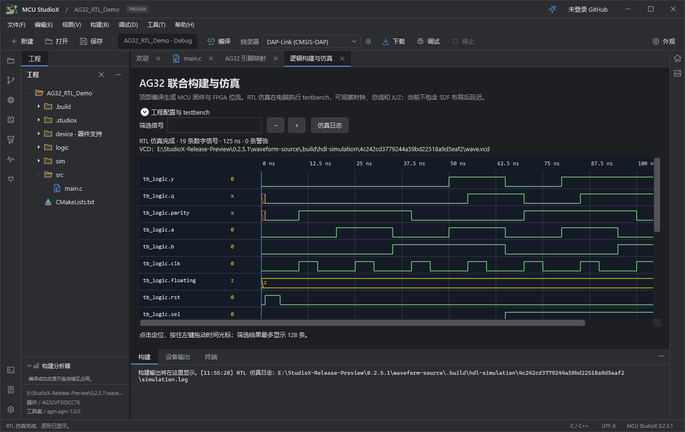

# MCU StudioX 0.2.5.1 预览版

日期：2026-09-28。Windows 10/11 x64。产品、界面与安装器使用同一版本号；器件包和开发环境组件继续单独锁定版本。

## 新功能

### AG32 图形化引脚分配

AG32 工程在左侧功能栏显示专用入口。支持七款精确型号及对应封装，左键点击引脚即可搜索并选择内部 GPIO 或外设功能。已分配引脚整条变绿并显示功能名；同一功能重复分配等冲突会将相关引脚标红，解决冲突后才能保存。时钟与引脚配置通过厂商转换器生成实际约束。

左键菜单与重复功能冲突示例：

### MCU 与 FPGA 一键联合构建

顶部编译 / F7 联合执行 MCU 编译、VE 转换、自定义 Verilog 综合、Supra 布局布线和逻辑镜像生成。支持源码、包含目录、宏与 SDC 配置；生成静态时序报告。源码、工具和镜像的内容校验防止继续使用过期产物。下载通过弹窗确认 MCU 与逻辑两段镜像的地址、大小和 SHA-256，分别写入与校验。

### Verilog 电路图

使用内置 Yosys 从实际 Verilog 生成电路连接图，支持层级查看、缩放和定位。无需外部 Quartus 或 VS Code 插件。

### RTL 仿真与波形

内置 Icarus Verilog，可配置 testbench、顶层、时长与超时。展示实际 VCD 的层级信号、总线、未知态和高阻态，支持筛选、时间轴缩放，以及左键拖动蓝色时间光标，实时查看该时刻的信号值。修改源码或仿真设置后，会标记旧波形。

### Agent 与插件扩展

- AG32 图形配置、逻辑构建配置与 RTL 仿真提供 MCP 接口；沿用文件变更、构建和硬件操作的授权边界。
- 通用插件支持命令、声明式面板和 Agent 工具。C# 使用版本化 SDK，Python、Rust、C++ 可通过进程协议接入；插件在独立宿主运行，首次安装与更新后须显式启用。
- AG32 下载器提供 DAP-Link（CMSIS-DAP）与 J-Link（V9 及以上）；改进下载诊断、确认窗口与引脚图交互。

## 使用与验证范围

- 本版完整源码和公开源码快照均编译通过，零警告、零错误；发行程序通过 56 项引脚界面检查、14 项电路图检查、8 项 RTL 波形检查，以及自包含启动验证。
- 完整安装包内置编译器、VE 转换器、Supra、Yosys、Icarus 和既有 SDK。Supra 布局布线仍需用户导入适用于本机的有效厂商许可证；许可证不随安装包分发。实板连接需要对应探针驱动。
- 当前为 **RTL 功能仿真与静态时序分析**，尚未接入带 SDF 的布局后延时仿真。
- AG32VF303CCT6 / CMSIS-DAP 已完成此前的实际联合下载、两段镜像校验与 MCU/FPGA 内部逻辑交互测试；不将这一结果推广到所有 AG32 型号或 J-Link。
- 本页截图来自本版程序运行的隔离示例工程，展示实际软件功能，不包含私人背景、账号、工程路径或许可证。
- 安装器为未签名预览版，附 SHA-256 校验文件；用户配置、API 密钥、登录凭据、聊天记录、Supra 私人许可和硬件备份均不进入发布内容。

详细步骤见 [AG32 引脚映射与逻辑](AG32_LOGIC_MODE.md)、[插件开发](PLUGINS.md)、[安装与升级](INSTALLER.md)。
