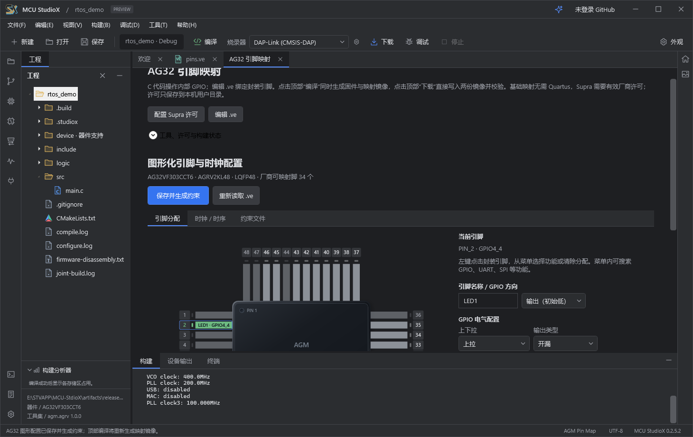
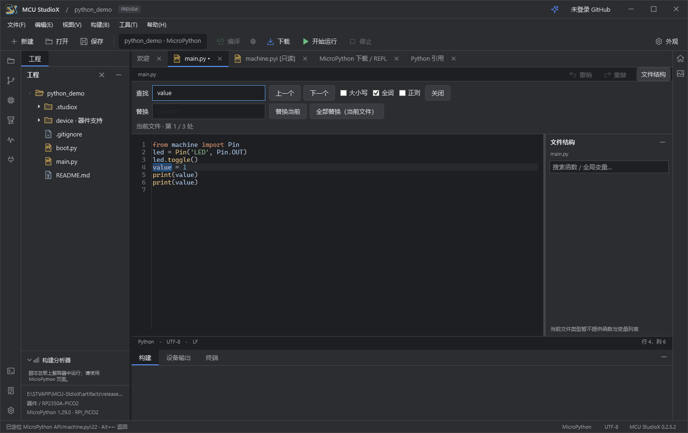

# MCU StudioX 0.2.5.2

本次从最新源码重新构建 Windows x64 安装包。产品和安装器版本为 0.2.5.2，GitHub 使用 `v0.2.5.2` 标识本次构建；原 `v0.2.5.1` 发布及标签保留。

## AG32

- 生成 `StudioX_System.h/.c`，统一引用外设头文件，集中管理时钟、GPIO 初始化及 `Delay_us`、`Delay_ms`、`Delay_1ms`。主函数保留应用逻辑。
- 命名引脚生成 `LED1_Port` / `LED1_Bit` 和 `LED1.Port` / `LED1.Bit`，VE 约束同步名称注释；GPIO 配置支持上下拉、推挽和开漏。
- 新增 FreeRTOS 工程模板；普通 MCU 与 MCU + FPGA 使用同一个模板，在新建工程时勾选特殊模式。切换模板保持用户选择。
- 系统层提供基于实际时钟的 RTOS 节拍、中断入口和错误钩子；FreeRTOS 采用锁定的 AGM 移植与内核源码，包内保留来源和许可。
- 构建分析器展示逻辑单元占用。联合下载直接使用已核验的 MCU 与逻辑镜像，移除重复确认弹窗。

## Python 与 Raspberry Pi

- Python 3 语法高亮、关键字与文件符号补全、定义跳转及查找引用。
- RP2040 与 RP2350 包同时提供 C SDK 和 MicroPython 模板，保留框架边界。
- MicroPython 使用顶部下载按钮进入脚本下载与 REPL，修正选中串口显示及页面布局，并提供运行入口。
- 编辑器补齐查找、替换与全部替换操作。

## 使用与验证范围

安装到已有 MCU StudioX 目录时保留用户工程、偏好及独立用户数据。内置开发环境组件与器件包随安装包提供；Supra 私人许可证仍由用户自行配置。安装器为未签名预览版，Release 附 SHA-256 校验文件。

Release 构建与自包含发布通过（0 警告、0 错误）。本次离线回归通过 287 项检查：Python 72 项、Python 导航 27 项、MicroPython 协议与文件传输 101 项、AG32 引脚规划 73 项、器件包保留策略 14 项；AG32 引脚、模板选择和两个 Raspberry Pi 系列的实际 WPF 界面检查也已通过。此前 AG32 七型号的 FreeRTOS 勾选/未勾选工程生成与真实编译已通过 116 项检查；这不等于所有型号完成实板 RTOS 验收。本次打包不连接或烧录硬件。

器件包版本独立于 IDE 版本。公开目录共 62 个包：新增 RP2040 0.2.0，RP2350 更新为 0.2.0，均包含 C SDK 与 MicroPython 模板。旧 RP2350 0.1.0 从当前下载目录及索引移除；其余包保留已有公开修订和许可材料，Git 历史不重写。完整清单见 [器件包仓库](https://github.com/XieJunHui9566/MCU-StudioX-MCUPacks)。

## 实际界面

以下截图来自本次 0.2.5.2 发布程序的隔离示例。串口为界面验证输入，未连接硬件。

### AG32 命名引脚、上下拉和开漏配置

### FreeRTOS 模板通过复选框启用 AG32 特殊模式

### MicroPython 下载、串口选择、开始运行与 REPL

### Python 编辑器查找、替换与全部替换

