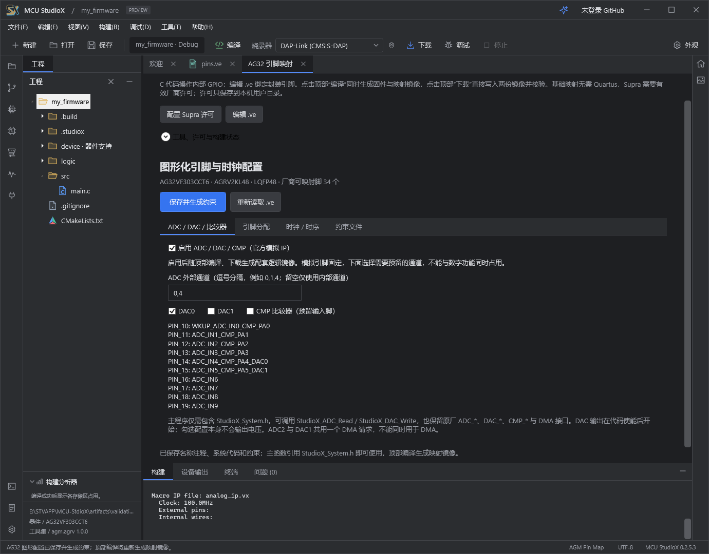

# MCU StudioX 0.2.5.3 · AG32 完整外设支持

本次为同版本功能补全，产品版本保持 **0.2.5.3**。安装包不捆绑插件，覆盖安装保留用户工程、个人设置和已安装插件。

## 修复与新增

- 修复 AG32 精简器件包只有部分外设声明、调用后缺少实现的问题。`StudioX_System.h` 统一接入完整原厂 SDK 驱动，旧包工程也可在保存引脚配置后补齐。
- 普通 MCU 和 FreeRTOS 工程新增 **ADC / DAC / 比较器** 配置页，按实际封装显示固定模拟引脚，阻止与数字功能重复占用。
- 顶部编译自动组合原厂 `analog_ip`、时钟和布线约束，核对最终 ADC/DAC/CMP 硬核位置。纯模拟配置不再要求额外分配 GPIO。
- 提供 ADC 单次采样、DAC 输出便捷接口，加入参数、忙状态、时钟检查与采样超时；修复旧 EOC 标志造成读到上一次结果的问题。
- 区分独立逻辑总线时钟与 MCU APB 分频；PLL 未就绪时便捷接口返回时钟错误。已分配的数字外设自动开启模块时钟和选定引脚的硬件复用。
- 保留原厂底层、DMA、比较器接口，记录原始资源版本和 SHA-256；不覆盖用户主函数或手动修改过的系统文件。

## 离线验证

- GCC 从真实头文件提取 **885 个接口**，七款已支持 AG32 型号全部编译链接通过；C++ 完整接口链接通过。
- 七款型号的模拟 IP 均完成实际 Supra 布局布线，0 错误、0 警告。
- ADC/DAC 两种逻辑时钟拓扑共 42 项寄存器模型检查；系统层 61 项、引脚规划/MCP 73 项、普通及混合 FreeRTOS 116 项、WPF 操作 60 项回归通过。

本轮按用户选择仅做离线验证，没有连接或烧录硬件；不把软件结果视为模拟精度、电压输出或外部设备通信的实板验收。自定义 Verilog 模式仍须由设计者集成模拟 IP 的总线、DMA 与约束，不能只添加配置注释。

操作与代码示例见 [AG32 外设说明](AG32_PERIPHERALS.md)。安装包及源码压缩包提供 SHA-256；器件包版本和已发布开发环境组件不作修改。
