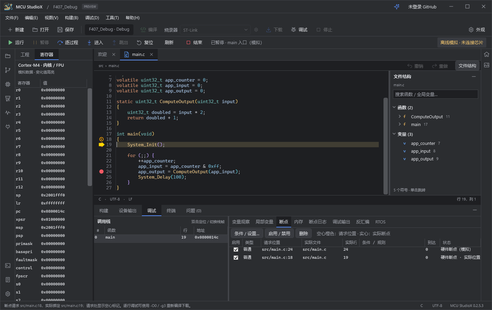
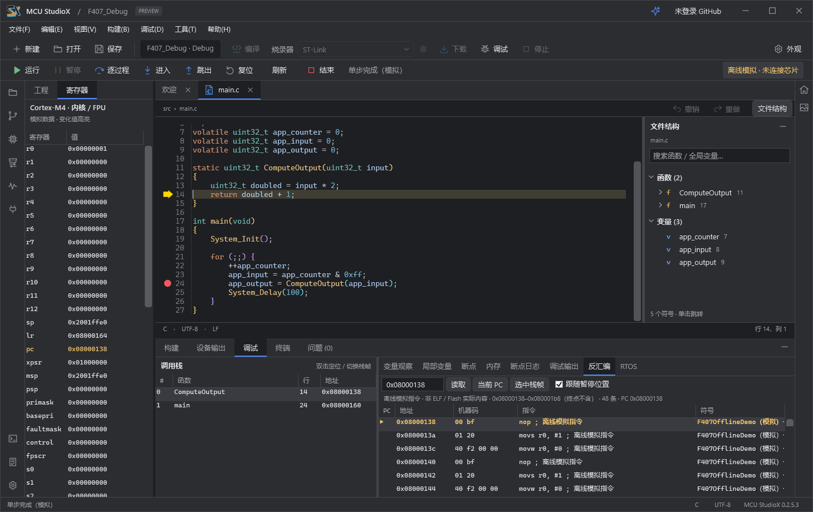

# MCU StudioX 0.2.5.3 同版本修复版

本次保持产品、程序和安装包版本为 **0.2.5.3**，发布标签 `v0.2.5.3-fixes-20260929` 用于区分修复后的源码和安装包，原发布标签保留。

## 修复内容

- **调试时错误提示遮挡代码**：进入调试后暂停实时诊断和编辑器诊断浮窗，清除旧标记；退出调试后重新解析并恢复显示。构建输出保留。
- **断点看起来跳到下一行**：保留用户设置位置，同时显示调试器实际绑定位置；空心标记表示请求位置，实心标记表示实际断点。断点表和提示说明优化、内联或该行没有独立指令的情况，点击任一位置均可删除对应断点。此修复改善显示与操作，不保证每个源代码行都存在可停靠指令。
- **AG32 引脚功能 VCC/GND 含义不清**：显示为“固定高电平（VCC）”和“固定低电平（GND）”，补充说明，避免与芯片电源引脚混淆。
- **插件入口与紧凑布局**：通用活动栏支持插件声明图标和入口；入口较多时可以滚动，面板可在紧凑窗口中使用。
- **插件表单刷新后复制旧结果**：刷新绑定当前结果，保留输入，避免导出内容与显示不一致。

## 安装与插件

此安装包**不捆绑插件**，不安装或更新用户插件。已有用户配置、工程与插件保存在独立用户数据目录中。

8 款官方插件的源码、截图和单独安装包已发布到 [MCU-StudioX-Plugins](https://github.com/XieJunHui9566/MCU-StudioX-Plugins)：PID 调参、RGB 灯效、蜂鸣器旋律、按键消抖、位运算、协议校验、波形与像素工具。

## 验证

- Release 全量编译：0 警告、0 错误。
- 真实 clangd 与编辑工作区回归：54 项通过。
- 发布文件验证：启动、深浅主题诊断显示 10 项、离线调试与断点位置、OpenOCD 绘图界面 20 项通过。
- 独立官方插件：29 项独立检查、74 项实验室宿主检查、96 项工坊宿主检查以及 8 个归档校验通过，使用隔离数据目录。

本轮未连接或烧录硬件。截图为离线调试示例。

