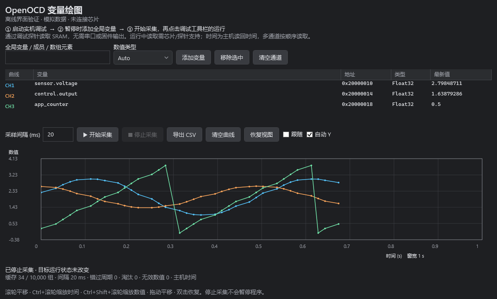
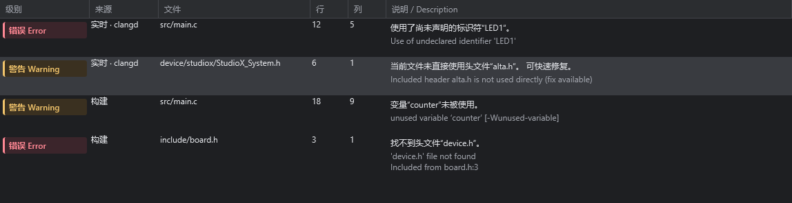
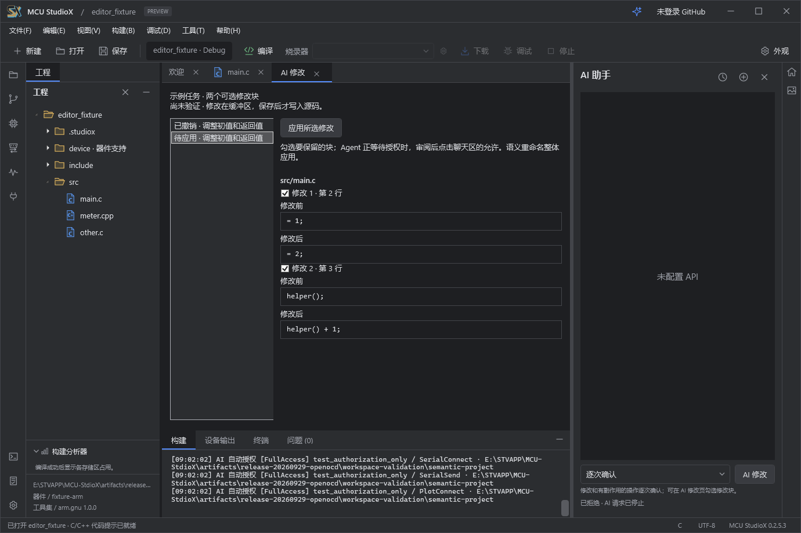

# MCU StudioX 0.2.5.3

本次更新完善通用编辑工作区和内置 AI Agent，并新增 OpenOCD 变量绘图。MCU StudioX 面向多系列 MCU，继续将工具链与运行环境放在 IDE 管理的目录中，不修改系统 PATH。

## OpenOCD 变量绘图

从「调试 → OpenOCD 变量绘图」进入，复用当前调试连接读取 SRAM 全局变量、结构体成员或固定数组元素，无需在固件中输出串口数据。支持最多 8 通道、整数与浮点数、20–10000 ms 采样间隔、曲线缩放/平移、开始/停止和 CSV 导出。

界面显示主机读回时间、暂停/运行状态、错过的采样周期、无效数值和缓存淘汰计数。结束调试或更换会话后，旧变量地址失效；读取失败会停止采集并保留原始错误，不通过循环暂停/运行模拟实时采样。运行中读取能力依赖具体芯片和探针，本版完成离线协议和界面验证，尚未完成实板采样验收。多通道和多字节读取不保证同步快照，适合趋势监控。

## 中英双语诊断

问题列表和编辑器悬停同时显示中文释义及工具原文。常见 clangd/GCC 诊断使用离线规则；未知诊断明确提示尚未收录中文释义。错误显示红色，警告显示琥珀色，选中行及深浅主题均保留级别颜色，复制说明包含中英两种文本。

## 编辑工作区

- 工程级搜索、替换预览和批量撤销；搜索包含已打开文件的未保存内容。
- C/C++ 实时诊断、查找引用、语义重命名、格式化和快捷修复。
- 快速打开、工程符号、命令面板、分组编辑、本地历史与布局保存。
- 重启恢复源码标签、光标、选区和未保存草稿；磁盘冲突会显式提示。
- 工具环境展示版本、空间与工程依赖，支持校验、离线导出及受校验的修复。

Python/MicroPython 继续提供现有编辑与静态导航能力，本版不将 C/C++ 语义功能表述为 Python 类型分析。

## 内置 Agent

Agent 可读取编辑器的未保存内容和实时诊断，生成跨文件修改预览，并支持按计划或任务撤销。界面区分尚未验证、编译失败和编译通过但尚未实板验证。

新增按工程保存的三种授权模式：

| 模式 | 行为 |
| --- | --- |
| 逐次确认 | 写入、构建、设备等操作继续显示授权卡 |
| 全面授权 | 自动批准当前工程编辑、构建与本地 Git 操作 |
| 完全访问 | 自动批准现有 Agent 工具的授权请求，包括外部目录读取、设备与 Git 远端操作 |

模式不会绕过文件冲突、目标身份、固件哈希和设备会话校验，也不额外提供任意终端命令。外部 MCP 客户端继续采用原有授权流程。

## 安装、源码与器件包

版本统一为 **0.2.5.3**。GitHub Release 提供 Windows x64 自包含安装包、对应源码、公开器件包合集、验证摘要和 SHA-256。覆盖安装使用原安装目录，保留用户工程、偏好及独立用户数据；安装包为未签名预览版。

器件包有独立版本号。此更新没有修改器件实现；公开包继续使用 [MCU-StudioX-MCUPacks](https://github.com/XieJunHui9566/MCU-StudioX-MCUPacks) 已发布且经过许可审查的目录，不回退现有公开修订，也不恢复已淘汰下载。

OpenOCD 绘图相关 52 项采样/协议检查、20 项实际 WPF 操作检查及 33 项已有调试回归通过。协议检查包含三套内置 OpenOCD 的真实 Tcl RPC，但内存数据由离线测试提供。双语诊断、编辑器及 Agent 的发布回归与安装校验结果详见 Release 附带的 `validation-summary.json`。本轮打包和安装不连接或烧录硬件。

操作细节见 [OpenOCD 绘图](OPENOCD-PLOT.md)、[编辑工作区](EDITOR_WORKSPACE.md)和 [AI Agent](AI_AGENT.md)。
